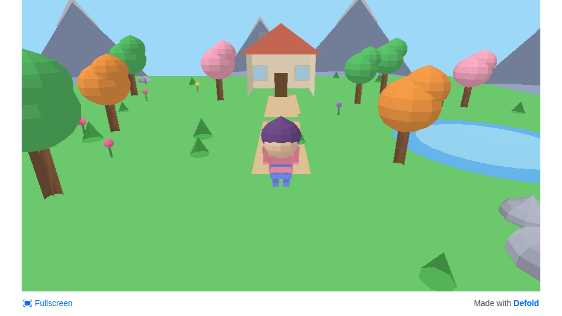

# Chibi World — a tiny 3D demo in Defold

A chibi-style 3D demo world built with [Defold](https://defold.com/) 1.13.2.
Everything is procedural — no downloaded assets. A controllable chibi
character explores a meadow biome with a house, trees, a pond, and
snow-capped mountains.



## Controls

- **WASD / arrow keys** — walk around
- **Space** — hop

## Run it

**Option A — Defold editor:** open `tiny-game/game.project` in the Defold
editor and hit Project → Build.

**Option B — command line** (needs the Defold toolchain — see `NOTES.md`):

```sh
# build + run headless (prints CHIBI WORLD READY)
node drive-defold-mcp.mjs
```

**Option C — playable HTML5 build:** bundle with `bob` (`NOTES.md` has the
exact commands; build per-platform — a stale native archive breaks wasm
bundles) and serve the output over HTTP (WASM won't run from `file://`):

```sh
cd html5-build && python3 -m http.server 8080
# open http://localhost:8080 in a WebGL2 browser
```

Screenshots from an actual headless-Chrome playthrough are in
`screenshots/` (`01_spawn` → `06_release`).

## Project layout

- `tiny-game/` — the Defold project: `game.project`, scripts (`main/`), input
  bindings, tests, and generated assets under `assets/meshes/`
  (39 flat-shaded `.gltf` meshes) plus 12 collections
- `tiny-game/tools/gen_meshes.py` — generates the procedural meshes
- `tiny-game/tools/gen_collections.py` — generates the collections
- `tools/` — dev/probe scripts (screenshots, headless runs, HTTP server)
- `drive-defold-mcp.mjs` — idempotent driver: scaffold → build → headless run
  → tests, via the Defold MCP server (`.mcp.json`)
- `NOTES.md` — full build notes, quirks, and gotchas

The world spawns deterministically (seed 1234).
